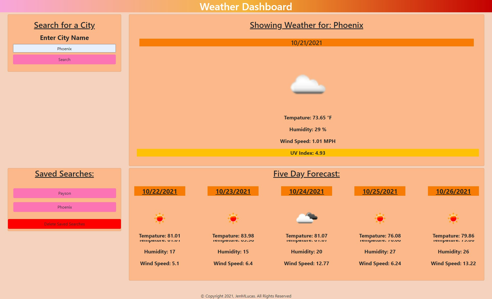

# WeatherDashboard

## Description
Weather Dashboard is an interactive weather app that allows you to enter in your city name, to display the current weather along with an additional 5 day forecast. Every search is then saved in local storage making it easy to switch back and forth from your favorite cities. The UV index is also presented with a color that indicates whether the conditions are favorable, moderate, or severe.

## Production Website

[Weather Dashboard](https://jenmlucas.github.io/weather-dashboard/ "Weather Dashboard")
 

## Usage
What your site will look like on your device

    
## Credits

To give thanks to all who have helped create this product.

[University of Arizona Bootcamp](https://courses.bootcampspot.com "UofA")

[Stack Overflow](https://stackoverflow.com/questions/7549561/section-vs-article-html5/ "StackOverflow")

[MDN Web DOCs](https://developer.mozilla.org/en-US/docs/Web/HTML/Element/aside "MDN")

## License

©Copyright 2021, JenMLucas. All Rights Reserved

## Badges

